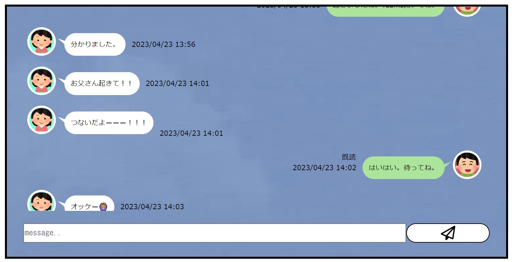

# Name（nehori/php-chat-like-line）

PHPとAjaxによるLINE風チャット（会話履歴はJSONファイルで管理）

# DEMO

# Features

* LINE風デザイン
* URLによるページ切り分け
* 「既読」機能
* スマホ向けレスポンシブルデザイン
* 画像表示機能（添付はできない）

# Requirement

* fontawesome-free-6.4.0-web
* アイコン画像2つ

# Usage

ファイルをアップロードしたら

https://アドレス/
https://アドレス/?man=1

でそれぞれアクセスする。

# Author

* Kazutaka Yasuda

# License

This is under [MIT license](https://en.wikipedia.org/wiki/MIT_License).
